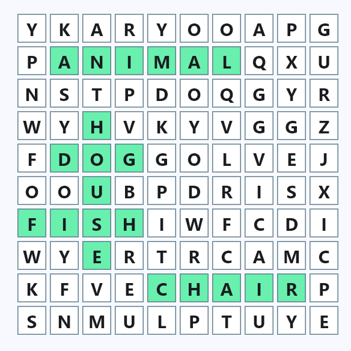
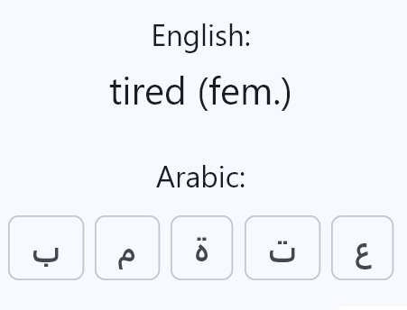
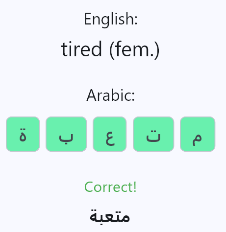
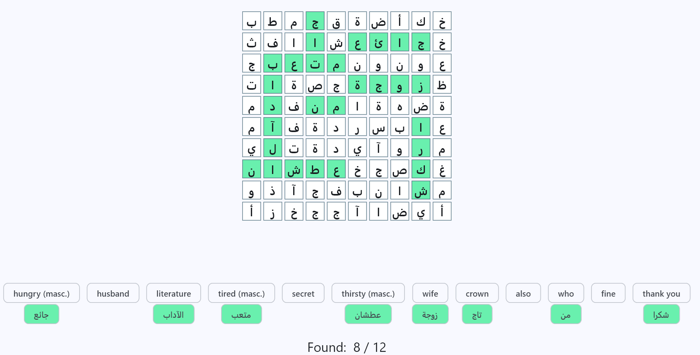
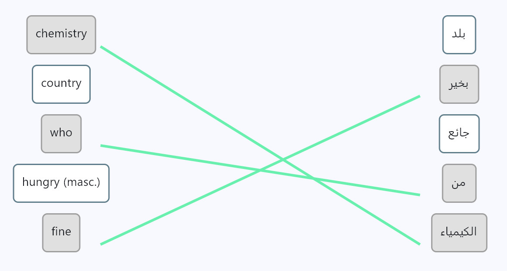
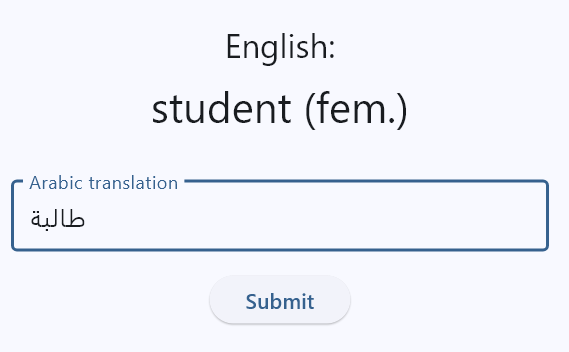

**LexiKon** is a free, open-source app to help you memorize vocabulary of a foreign language through fun exercises. The exercises are designed to help you get more familiar with the visual representation of the words in the foreign language, and to help you memorize the translation from your 'source' language (e.g. your native tongue) to the 'target' language (the foreign language you're learning). This app is designed to be used as a (fun) supplement to standard language learning techniques and not as a standalone learning app, when learning a second (or third, or fourth) language as a teenager or as an adult.

You can upload any custom list of word pairs, or use a pre-defined one from https://github.com/svlandeg/lexivok.

🚧 Note that this repo is under active development and not yet fit for external usage. There will be backwards incompatibilities in the serialization format in the near future, and the code will still undergo refactors as functionality and unit tests are added.

## ✨ Features

* Support for languages in either reading direction: left-to-right or right-to-left
* Support for multiple vocabulary lists, allowing you to use the app for different languages or to create distinct word lists to practice separately.
* Various types of exercises to practice your vocabulary knowledge, including a word search, flashcards, unscrambling letters and connecting the right pairs ... and more to come.
* Supported platforms:
   * Currently only developed and tested for Windows
   * Coming up soon: support for Android
   * On the road map: support for iOS
 
## 🎉 Exercises

### Unscrambling

This exercise shows the 'source' word in the language you already know (e.g. your native tongue), and the letters of the translation in the target language you're learning. You have to drag the letters in the correct order, and the app will tell you once it's correct and then you can move on to the next word. Before starting the exercise, you can chose how many words you want to get quized on, and the app will select a random subset of your vocabulary. 

  &nbsp;&nbsp; → &nbsp;&nbsp;

### Word search

When starting this exercise, a 10x10 word search will be displayed with at most 12 words, randomly selected from your vocabulary. There are two modes to use this:
   * **Hard** (default, cf. image below): shows only the words in the source language as a hint to find the words of your target language in the grid. When a word is found, it is highlighted in green and automatically matched to the correct translation in the word list below the grid.
   * **Easy**: shows the words in the target language to help you find them in the grid. The translation in the source language is displayed as well. When a word is found, it is highlighted in green in the grid and in the list of hints.

### Connect the right pairs

Five words are displayed on the left (source language) and five on the right - your job is to connect the correct translations. Upon startup, the user can select how many words to practice in total, but they will be shown 5 at a time.

### Flashcards

The flashcards exercise presents you the 'source' word in the language you already know (e.g. your native tongue), and asks you to type the word of the target language you're learning. You can chose how many cards you want to get quized on, and the app will select a random subset of your vocabulary. After each word, it will show whether the answer was correct or not. At the end of the quiz, it will give you a percentage of correct answers.

## 📝 FAQ

* How do I start using the app?
  * First, fetch yourself a word list that suites your learning goals. You can create one yourself (in CSV format, using a simple text editor) or download a dummy one from https://github.com/svlandeg/lexivok
  * Create a new vocabulary on the "Vocabularies" tab, then tap it, and upload this CSV file with the "Import CSV" button
  * Navigate to the "Practice" tab and pick an exercise to start practicing your vocabulary knowledge!
* Why doesn't the app come with built-in vocabulary lists?
  * The app is specifically designed to be agnostic to which language(s) you want to learn, and which words you want to practice. This should depend entirely on the language journey you're already on, be it in a school setting, a hobby or a language class you're taking for work. You should generate vocabulary lists that are relevant to your knowledge and skill level of the language you're currently learning.

